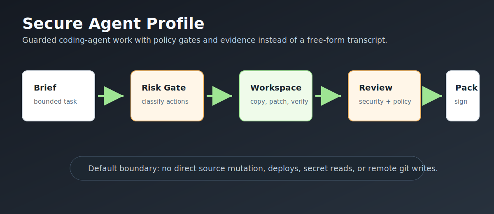
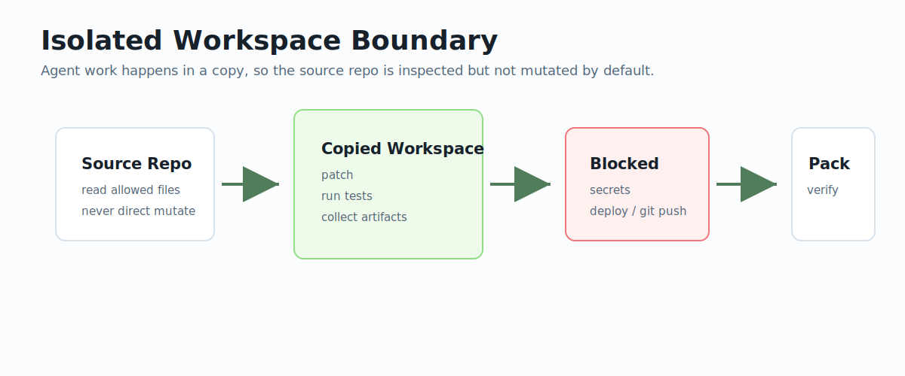
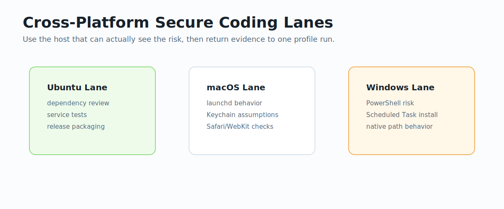
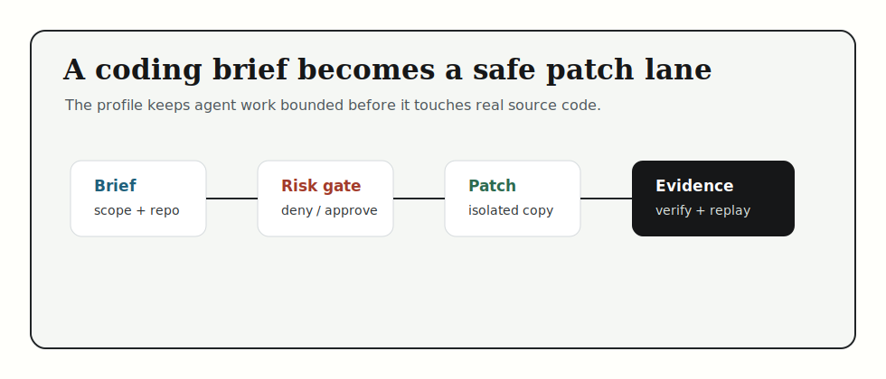
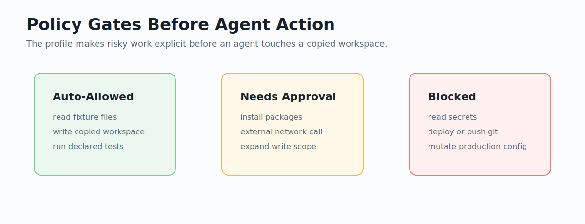

# Secure Agent Profile

**Secure coding profile for AO Operator. Start with
[`ao-operator`](https://github.com/uesugitorachiyo/ao-operator), then run this
repo to see policy-gated software work.**

Secure Agent Profile is a reusable AO Operator profile for teams that want to
ask for a safe code change in natural language and receive a bounded patch,
verification output, reviewer notes, and signed replayable evidence.

It is not a separate security platform. It is the profile that shows how AO
Operator handles software work when the requester cares about the finished
result and the proof behind it: what changed, what was blocked, what was
verified, and what still needs human review.



## Public Repo Set

The repos are public together, but the advertisement should still name one
product: **AO Operator**.

| Repo | What it is | How to read it |
| --- | --- | --- |
| [`ao-operator`](https://github.com/uesugitorachiyo/ao-operator) | The product: role contracts, RunSpecs, provider routing, evidence packs, release gates | **Start here. Clone this first.** |
| [`ao-runtime`](https://github.com/uesugitorachiyo/ao-runtime) | The Rust execution engine: DAG scheduler, policy seam, event log, artifacts, workers, adapters | Read when you want to understand or embed the engine. |
| [`financial-services-profile`](https://github.com/uesugitorachiyo/financial-services-profile) | Flagship demo profile: citation-sensitive financial workflows over public/synthetic data | Run after AO Operator to see the regulated-workflow story. |
| `secure-agent-profile` | Reusable secure coding-agent profile: guarded patching, dependency review, PR evidence | You are here. Run this after AO Operator. |
| [`ao-control-plane`](https://github.com/uesugitorachiyo/ao-control-plane) | Future management layer: typed run state, evidence aggregation, release-train gates | Read last. It is not required for the first product trial. |

Advertise this repo as a reusable AO Operator profile for safe coding-agent
workflows. The user-facing promise is simple: describe the desired safe change,
let AO Operator route the work through guarded roles, and accept the result only
when evidence exists. Do not advertise it as a separate security platform at
first launch.

## How To Ask For Work

Start in AO Operator or in this repo with a result-oriented request:

```text
Use the secure-agent profile to make this Python service safer without changing
public behavior. Keep the change bounded, run the declared checks, block risky
actions, and return a patch plus evidence I can review.
```

The profile turns that request into concrete roles and artifacts:

- isolated workspace copy;
- declared read/write scope;
- policy decisions for risky actions;
- dependency and secret checks;
- verification output;
- evidence pack and replay report.

## Paste Into Codex Or Claude Code

Use this as the first trial from an AI CLI. It keeps the user request focused
on the desired safe change and asks for evidence before acceptance.

```text
Clone https://github.com/uesugitorachiyo/ao-operator.git and
https://github.com/uesugitorachiyo/secure-agent-profile.git if needed.

Use AO Operator plus the secure-agent profile to run the provider-free guarded
code-change sample.

Requirements:
- Do not set OPENAI_API_KEY or ANTHROPIC_API_KEY.
- Use local CLI auth only if live provider execution is explicitly needed.
- Run the profile doctor and tests.
- Run guarded-code-change against the safe Python service fixture.
- Report the requested safe-change outcome, policy decisions, verification
  output, evidence-pack path, replay status, and any blocker.
```

## Workflows

- `guarded-code-change`: generates a bounded patch in an isolated workspace,
  runs declared verifiers, reviews security evidence, and emits an evidence pack.
- `dependency-review`: inspects dependency manifests without installing
  packages.
- `pr-evidence`: produces a read-only evidence pack for an existing patch or
  branch.

## Quickstart

```sh
git clone https://github.com/uesugitorachiyo/secure-agent-profile.git
cd secure-agent-profile
python3 -m secure_agent_profile.cli doctor
python3 -m pytest -q
python3 -m secure_agent_profile.cli run guarded-code-change \
  --brief examples/secure-agent/guarded-code-change/task-brief.md \
  --repo examples/secure-agent/fixtures/safe-python-service \
  --run-id guarded-code-change-final-20260512
```

## AO Runtime Execution







```sh
python3 -m secure_agent_profile.cli run guarded-code-change \
  --engine ao \
  --brief examples/secure-agent/guarded-code-change/task-brief.md \
  --repo examples/secure-agent/fixtures/safe-python-service \
  --run-id guarded-code-change-ao-final-20260512
```

Each run writes:

- `runspec.yaml`
- `events.ndjson`
- `policy.ndjson`
- `approvals.json`
- `secure-agent/*`
- `evidence-pack-<run_id>.tar.zst`
- `verification.json`
- `replay-result.json`

## Verify And Replay

```sh
python3 -m secure_agent_profile.cli verify runs/<run-id>/evidence-pack-<run-id>.tar.zst
python3 -m secure_agent_profile.cli replay runs/<run-id>/evidence-pack-<run-id>.tar.zst
```

## Boundaries



- No direct source-repo mutation. Work happens in a copied workspace.
- No deploys, remote git writes, secret reads, production config writes, or
  destructive commands in v1.
- Package installs and external network calls require approval.
- Evidence export fails if required secure-agent artifacts are missing.
